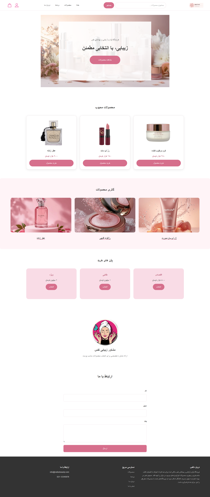

# Nafas Beauty Store

A responsive e-commerce website for a beauty and personal care store.

## About the Project

Nafas Beauty is a modern beauty and personal care online store designed to provide users with a simple, elegant, and responsive shopping experience.

The website focuses on clean layouts, soft colors, product presentation, and easy navigation.

## Features

- Responsive design for mobile and desktop
- Mobile-First CSS approach
- Semantic HTML structure
- Product cards
- Product gallery
- Search form
- Navigation menu
- User login section
- Shopping cart section
- Beauty consultation section
- Contact form
- Pricing plans
- Responsive footer
- Hover and focus effects

## Technologies Used

- HTML5
- CSS3
- Flexbox
- CSS Grid
- Responsive Design
- Mobile-First Design
- Semantic HTML

## Screenshot

## Live Demo

  https://mahshadaliyari.github.io/CSS-project/

  ## AI Transparency

- **Section:** Responsive breakpoints (media query sizing) and CSS Grid column layout.
- **How I used it:** I first tried and tested breakpoint values myself, then asked the AI to suggest example sizes and explain the reasoning behind them for comparison. For the grid layout, I shared my existing HTML and asked the AI to review it and point out issues — without generating or rewriting the code itself.
- **What I changed/decided myself:** I chose the final breakpoint values and grid structure myself; the AI was only used for feedback and comparison, not for producing the code.